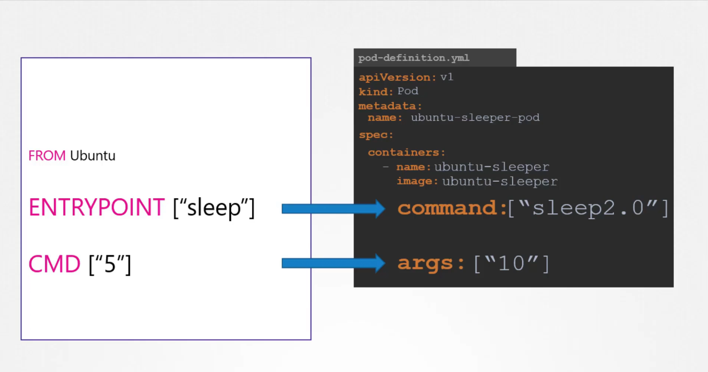

## Commands and Arguments:
Commands and arguments are the main settings of our docker images, which tells us what the container will do when it starts.

### In Docker:
If we look into the Dockerfile there are two kinds of commands 
1. Entrypoints: It is the command that must be executed when a containers starts
2. CMD: This is the arguments which will be executed in case we didnot pass any argument in docker run command. for image built using Dockerfile2 it will override the cmd

    - docker run image --color green

### In Kubernetes:
In case of k8s pod manifest files
1. Command: this is used as an Entrypoint concept in dockerfile
2. ARGS: this is used as cmd in dockerfile

