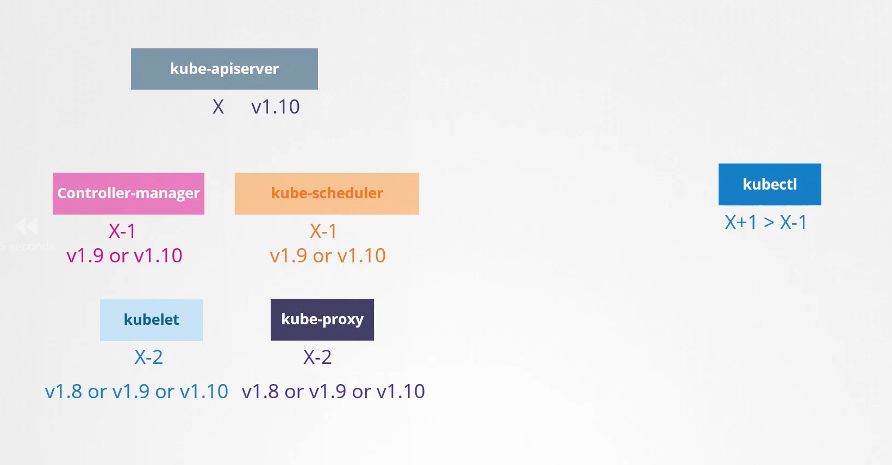
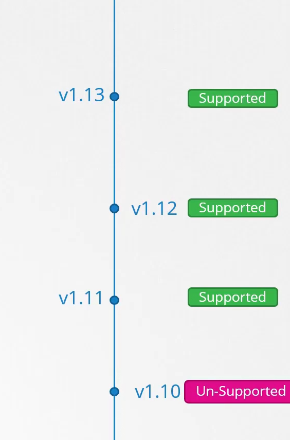

Before Upgrading a Cluster to a new version there are some prerequisites need to be done.

## Draining the Nodes:
While upgrading components on a node we need to 
1. Cordon the node so that the node is not available for further pods
2. Drain the nodes which will gracefully create the pods of the current node on another node and then terminate the pod on the present node.

    kubectl drain node node_name

> PODs THAT'RE NOT PART OF REPLICASET CAN'T BE DRAINED

> In CASE we DRAIN it FORCEFULLY, the POD wil be LOST Forever.

## Uncordon the node:
After Upgrading the cluster we need that node is available for further pods to be scheduled.

    kubectl uncordon node node_name

## Components of K8s
The main components of k8s are given below some of them are separate version so we have compatibilty with specific versions as mentioned

## Supported Version of k8s:

kubernetes support just recent 3 minor releases.

## Recommended:
If we want to upgrade fron version 1.10 to 1.13, the recommended approach is to update a minor release at a time.
