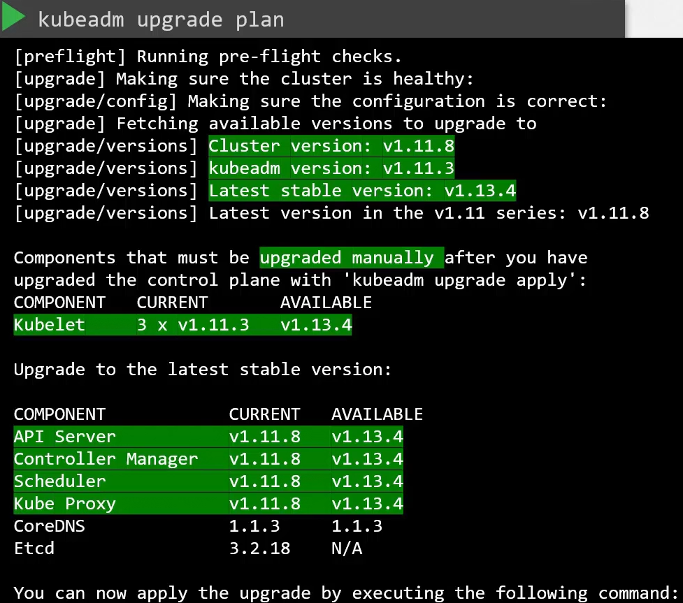

## Cluster Upgrading

### Prerequisite:
1. Strategy: Select strategy of how you want to do the whole process
2. This command will show you the complete details of the current versions.

    kubectl upgrade plan

## Steps To Upgrade Master Nodes:
### Upgrade Kubeadm:

    sudo apt-mark unhold kubeadm && \
    sudo apt-get update && sudo apt-get install -y kubeadm='1.29.x-*' && \
    sudo apt-mark hold kubeadm

### Upgrade Cluster:

    kubeadm upgrade apply v1.12.0

### Upgrade Kubelet:

    sudo apt-mark unhold kubelet kubectl && \
    sudo apt-get update && sudo apt-get install -y kubelet='1.29.x-*' kubectl='1.29.x-*' && \
    sudo apt-mark hold kubelet kubectl

### Restart the Kubelet

    sudo systemctl daemon-reload
    sudo systemctl restart kubelet

## Steps to upgrade Worker Nodes:

### Drain the node:

    kubectl drain node_name

### Upgrade Kubeadm:

    sudo apt-mark unhold kubeadm && \
    sudo apt-get update && sudo apt-get install -y kubeadm='1.29.x-*' && \
    sudo apt-mark hold kubeadm

### Upgrade the Node:

    sudo kubeadm upgrade node

### Upgrade Kubelet:

    sudo apt-mark unhold kubelet kubectl && \
    sudo apt-get update && sudo apt-get install -y kubelet='1.29.x-*' kubectl='1.29.x-*' && \
    sudo apt-mark hold kubelet kubectl

### Restart the Kubelet

    sudo systemctl daemon-reload
    sudo systemctl restart kubelet

### Cordon The Node:

    kubectl cordon node_name