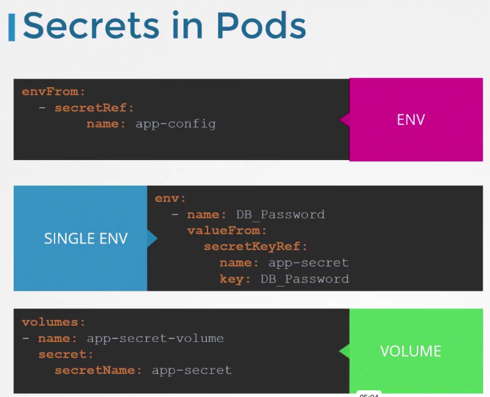
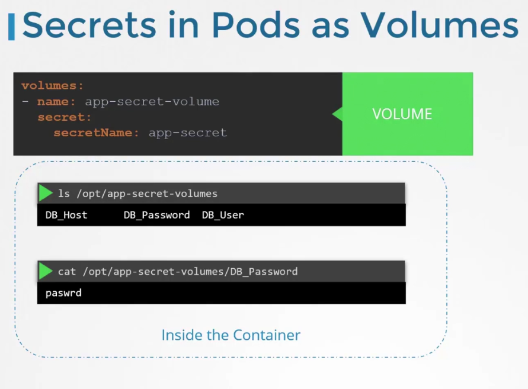

## Secrets in K8s

### Encode and Decode
Secrets are not encrypted they are only encoded using base64 as

    - echo -n "myvalue" | base64
    # To Decode
    - echo -n "bXl2YWx1ZQ==" | base64 --decode

## Flags

# from-env-file:
- Specify the path to a file to read lines of key=val pairs to create a secret (i.e. a Docker .env file).
# from-file
- Key file can be specified using its file path, in which case file basename will be used as secret key, or optionally with a key and file path, in which case the given key will be used. Specifying a directory will iterate each named file in the directory whose basename is a valid secret key.
# from-literal
- Specify a key and literal value to insert in secret (i.e. mykey=somevalue)

## Examples:
> Create a new secret named my-secret based on folder bar

    - kubectl create secret generic my-secret --from-file=/root/bar

> Create a new secret named my-secret with specified keys instead of file basenames on disk

    - kubectl create secret generic my-secret --from-file=key1=file1.txt --from-file=key2=file2.txt

> Create a new secret named my-secret with key1=config1 and key2=config2

    - kubectl create secret generic my-secret --from-literal=key1=config1 --from-literal=key2=config2

> Create a new secret named my-secret from the key=value pairs in the file

    - kubectl create secret generic my-secret --from-file=/root/file.txt

> Create a new secret named my-secret from an env file

    - kubectl create secret generic my-secret --from-env-file=path/to/bar.env

