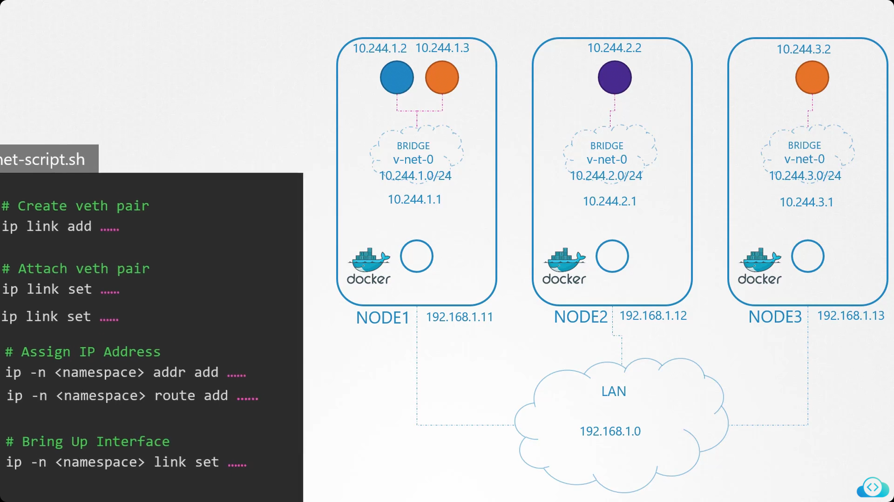
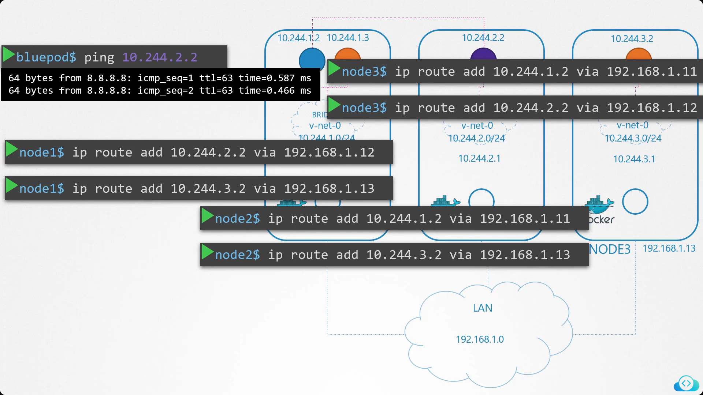
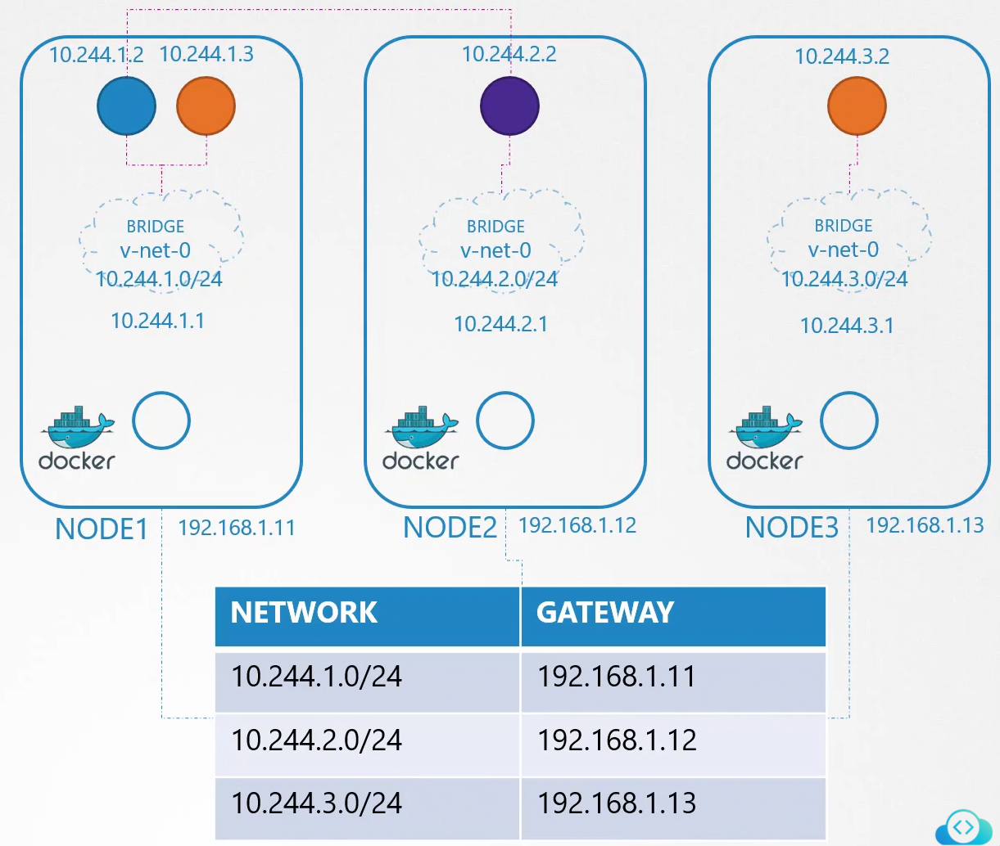

# Pod Networking:
As we know we are going to have various number of of pods in various nodes of our cluster so how these communicate
1. Create a Bridge Network on every node having IP CIDR as 10.244.1.0/24, 10.244.2.0/24, 10.244.2.0/24 etc
2. Create Intra node communication of Pods:
        
        Create a link or a pipe on each pod
        Link the pipe to the bridge which act as switch
        Other end of the pipe is linked to the pod
        Assign IPs to the pods interface
        Add a route in the route table.
        Bring the state of INterface to UP.

## To run these commands for each container or pod write a script as: 

3. Create Inter Node Communication of Pods:

        Add routes in all nodes for the specific nodes presents as shown

        A better approach, to add routes on each node, is to add routes on the router and attach all nodes to the router as:
