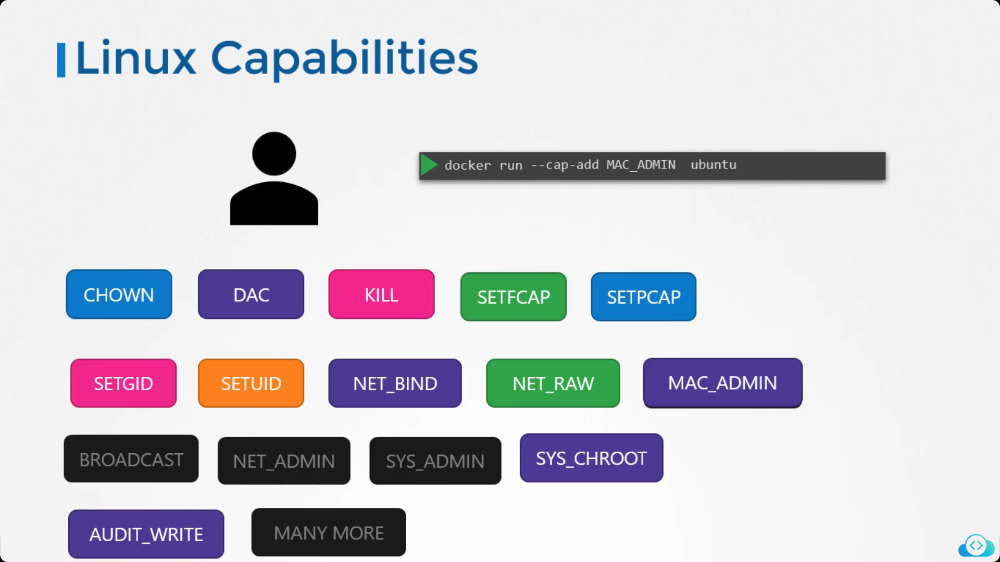

# Linux Capabilities:

Linux Capabilities are 

## Docker Security:
Docker utilizes linux capabilities as it does not gives all permissions to the root user of the container as given in image.
### Docker Default Privilages:

```bash 
    docker run -p 80:80 image_name  
```


### Docker Add Privilages:
```bash 
    docker run -p 80:80 --cap-add MAC_ADMIN image_name  
```


### Docker Drop Privilages:
```bash 
    docker run -p 80:80 --cap-drop KILL image_name  
```


### Docker Full Privilages:
```bash 
    docker run -p 80:80 --priviliged image_name  
```


# Security Context in K8s:

### Manage Capabilities:
To manage linux capabilities and user running the pod or container we do these configuration


### RunAsUser:
This is an alternative of this command:
```bash
    docker run -p 80:80 --user 1000 image_name
```